<picture>
  <source media="(prefers-color-scheme: dark)" srcset="docs/brand/logo-horizontal-dark.svg">
  
</picture>

[](LICENSE)

**A multi-agent CTI pipeline that turns raw CVE feeds and threat intel into a prioritized executive brief tailored to your stack.**

Delvn ingests signals from three source families: NVD CVEs, AlienVault OTX intel pulses, and security RSS advisories - correlates related activity using vector similarity, ranks every finding against your declared technology stack, and renders a concise markdown brief a human can act on.

Built for the **Microsoft AI Dev Days Hackathon 2026**.

---

## How It Works

```
CVE feed (NVD)  ──────┐
OTX intel pulses ─────┤──► collector agents ──► normalize ──► Cosmos DB (threats)
RSS advisories ───────┘                                              │
                                                                     │
                                                          correlator agent
                                                      (Azure AI Search vectors)
                                                                     │
                                                          CorrelationLink docs
                                                                     │
                                                          prioritizer agent
                                                       (stack profile: products /
                                                        platforms / keywords /
                                                        exclude)
                                                                     │
                                                        HIGH / MEDIUM / LOW / NONE
                                                                     │
                                                          reporter agent
                                                     (Azure OpenAI / hash fallback)
                                                                     │
                                                      executive markdown brief
```

**Key properties:**

- **Three ingestion paths**: NVD CVEs (paginated), OTX pulses (subscribed + public fallback), and configurable RSS feeds run as independent collector agents.
- **Vector correlation**: The correlator embeds threat text with Azure OpenAI (falls back to deterministic hash vectors when credentials are absent), indexes into Azure AI Search, and links nearest-neighbor pairs above a confidence threshold.
- **Stack-aware prioritization**: Every threat is scored `HIGH / MEDIUM / LOW / NONE` based on keyword overlap with your `products`, `platforms`, and `keywords` list - with `HIGH` requiring both a product match and severity ≥ 7.0 or an exploited tag.
- **Executive brief rendering**: The reporter converts ranked threats into structured `BriefEntry` objects with headlines, evidence, and recommended actions, then writes a markdown file ready for review.
- **Safe by default**: `--dry-run` validates config and prints the planned pipeline without any external API calls or Azure writes.

---

## Features

- Collects CVEs from the NVD 2.0 API with optional API key for higher quota
- Collects intel from AlienVault OTX (falls back from subscribed to public pulses)
- Collects security advisories from configurable RSS feeds via `feedparser`
- Normalizes all signals into a canonical `UnifiedThreat` model (Pydantic v2)
- Embeds and indexes threat text into Azure AI Search (HNSW vector profile)
- Correlates related threats with explainable confidence-scored `CorrelationLink` records
- Scores relevance: `HIGH` (product + severity≥7 or exploited) → `MEDIUM` (product match) → `LOW` (platform/keyword) → `NONE`
- Generates an `ExecutiveBrief` with top risks, notable mentions, evidence, and recommended actions
- Renders a clean executive markdown brief for leadership review
- Dry-run mode (safe for judges, CI, and local rehearsal; no credentials needed)
- Exponential-backoff HTTP client shared across all integrations (up to 5 retries)
- Hash-based deterministic embedding fallback when Azure OpenAI credentials are absent

---

## Quickstart

**Prerequisites:**

| Tool | Version |
|------|---------|
| Python | 3.11+ |
| uv | any recent |

```bash
git clone https://github.com/Microck/delvn.git
cd delvn
uv sync --frozen
uv run python demo/run_demo.py --dry-run
```

Expected output:

```
DRY RUN: no external APIs will be called and no Azure writes will occur.
Config: /path/to/demo/config.yaml
Stack: Apache HTTP Server, PostgreSQL, React
Planned flow:
1) collect -> CVE(results_per_page=25), Intel(limit=25), News(default feeds)
2) correlate -> top_k=8, limit=120, min_confidence=0.35
3) prioritize -> limit=120 for stack profile from config
4) report -> top_risks=5, notable_mentions=3, output=docs/demo_brief.md
```

---

## Installation

```bash
uv sync --frozen
```

All runtime and development dependencies are pinned in `uv.lock`.

---

## Usage

### Dry-run (no credentials required)

Validates the config, prints the planned pipeline, exits cleanly. Safe for judges, CI, and local rehearsal.

```bash
uv run python demo/run_demo.py --dry-run
```

Pass a custom config:

```bash
uv run python demo/run_demo.py --dry-run --config path/to/my-config.yaml
```

### Live mode (requires Azure credentials)

Runs the full end-to-end pipeline: collect → correlate → prioritize → report.

```bash
uv run python demo/run_demo.py --live
```

Or with a specific config:

```bash
uv run python demo/run_demo.py --live --config demo/config.yaml
```

Live run requires `COSMOS_ENDPOINT`, `COSMOS_KEY`, `SEARCH_ENDPOINT`, and `SEARCH_KEY` to be set. The runner checks for these upfront and exits with a clear error listing every missing variable before any data is written.

---

## Configuration

### Stack Profile

Edit `demo/config.yaml` to describe your technology environment. The prioritizer scores every threat against this profile.

```yaml
stack:
  products:
    - Apache HTTP Server
    - PostgreSQL
    - React
  platforms:
    - Linux
  keywords:
    - httpd
    - postgres
    - frontend
  exclude:
    - Windows

run:
  collection_window_days: 7      # How far back to pull CVEs
  max_items_per_source: 25       # Default cap per source
  cve_results_per_page: 25       # NVD results_per_page (max 2000)
  intel_limit: 25                # OTX pulse limit
  correlation_limit: 120         # Max threats fed into correlator
  correlation_top_k: 8           # Nearest neighbors per query
  correlation_min_confidence: 0.35  # Minimum confidence to store a link
  prioritization_limit: 120      # Max threats scored by prioritizer
  report_top_risks: 5            # Max top-risk entries in brief (capped 3–5)
  report_notable_mentions: 3     # Additional notable entries
  report_output_path: docs/demo_brief.md
```

**Scoring rules:**
- `HIGH` - product match + (severity ≥ 7.0 or `exploited` tag)
- `MEDIUM` - product match only
- `LOW` - platform or keyword match (no product match)
- `NONE` - no stack keyword found in threat content

### Environment Variables

Create a `.env` file in the project root (loaded automatically by `pydantic-settings`):

```
cp .env.example .env   # or create manually
```

| Variable | Required for | Description |
|---|---|---|
| `COSMOS_ENDPOINT` | `--live` | Azure Cosmos DB account endpoint URL |
| `COSMOS_KEY` | `--live` | Azure Cosmos DB primary key |
| `SEARCH_ENDPOINT` | `--live` | Azure AI Search service endpoint |
| `SEARCH_KEY` | `--live` | Azure AI Search admin key |
| `AZURE_OPENAI_ENDPOINT` | `--live` (embeddings) | Azure OpenAI service endpoint |
| `AZURE_OPENAI_API_KEY` | `--live` (embeddings) | Azure OpenAI API key |
| `AZURE_OPENAI_EMBEDDING_DEPLOYMENT` | `--live` (embeddings) | Deployment name for the embedding model |
| `AZURE_OPENAI_API_VERSION` | `--live` (embeddings) | API version (default: `2024-02-01`) |
| `FOUNDRY_ENDPOINT` | optional | Azure AI Foundry project endpoint |
| `FOUNDRY_API_KEY` | optional | Azure AI Foundry API key |
| `NVD_API_KEY` | optional | NVD API key for higher anonymous quota |
| `OTX_API_KEY` | optional | AlienVault OTX API key (falls back to public pulses) |

When `AZURE_OPENAI_*` variables are absent, the correlator uses a deterministic hash-based embedding client so the pipeline remains fully runnable without any Azure credentials.

---

## Output

The pipeline writes an executive markdown brief to the path set by `run.report_output_path` (default: `docs/demo_brief.md`).

**Brief structure:**

```
# Executive Threat Brief

_Generated: <ISO timestamp>_

## Executive Summary
<Stack-aware narrative paragraph>

## Top Risks
### 1. <Headline>
- **Relevance:** HIGH | MEDIUM
- **Why it matters:** <reason chain>
- **Evidence:** <up to 5 evidence points>
- **Recommended actions:**
  - <action 1>
  - <action 2>
  - <action 3>

## Notable Mentions
- <item>
- <item>
- <item>

## Recommended Next Steps
1. <prioritized action>
2. ...
```

**Example output snippet (`docs/example_brief.md`):**

```markdown
## Top Risks

### 1. Apache HTTP Server path traversal chain observed in active exploit traffic

- **Relevance:** HIGH
- **Why it matters:** Directly matches internet-facing Apache services in scope and
  has active public proof-of-concept exploitation.
- **Evidence:**
  - NVD feed flagged high severity web server vulnerability
  - OTX indicators include exploit host and callback domains
  - Multiple matching references across CVE + intel + reporting feeds
- **Recommended actions:**
  - Patch Apache instances to the latest fixed release within 24 hours
  - Add temporary WAF rule for suspicious traversal payloads
  - Hunt logs for matching indicators in the last 7 days
```

See `docs/example_brief.md` for the full example.

---

## Architecture

```mermaid
flowchart TD
    subgraph Ingestion
        A1[cve_agent\nNVD 2.0 API]
        A2[intel_agent\nAlienVault OTX]
        A3[news_agent\nSecurity RSS]
    end

    subgraph Storage
        C1[(Cosmos DB\nthreats container)]
        C2[(Azure AI Search\nthreats index)]
    end

    subgraph Correlation
        B1[correlator_agent\nEmbed + HNSW query]
        B2[(Cosmos DB\ncorrelations container)]
    end

    subgraph Prioritization
        D1[prioritizer_agent\nStack profile scoring]
    end

    subgraph Reporting
        E1[reporter_agent\nBrief assembly]
        E2[render_brief_md\nMarkdown renderer]
        E3[docs/demo_brief.md]
    end

    A1 -->|UnifiedThreat| C1
    A2 -->|UnifiedThreat| C1
    A3 -->|UnifiedThreat| C1

    C1 -->|list_recent_threats| B1
    B1 -->|index_threats| C2
    C2 -->|vector_query top_k| B1
    B1 -->|CorrelationLink| B2

    C1 -->|ranked list| D1
    B2 -->|correlation_count| D1

    D1 -->|HIGH/MEDIUM/LOW/NONE| E1
    E1 --> E2
    E2 --> E3
```



Full component table and failure-mode reference: [`docs/architecture.md`](docs/architecture.md)

### Data Models

| Model | Purpose |
|---|---|
| `UnifiedThreat` | Canonical cross-source threat object (id, source, type, title, summary, severity, indicators, tags, references) |
| `CorrelationLink` | Relationship between two threats (source_id → target_id, confidence, reasons) |
| `ExecutiveBrief` | Structured brief payload (stack_summary, top_risks, notable_mentions, generated_at) |
| `BriefEntry` | Single risk entry (headline, relevance, why_it_matters, evidence, recommended_actions) |

### Storage

| Resource | Container / Index | Partition key |
|---|---|---|
| Cosmos DB `delvn` | `threats` | `/source` |
| Cosmos DB `delvn` | `correlations` | `/id` |
| Azure AI Search | `threats` (HNSW `tf-vector-profile`) | `contentVector` (dim 1536) |

---

## Repository Layout

```
delvn/
├── demo/
│   ├── run_demo.py          # Orchestration entrypoint (--dry-run / --live)
│   └── config.yaml          # Stack profile + run parameters
├── docs/
│   ├── architecture.md      # Component table, data models, failure modes
│   ├── example_brief.md     # Example pipeline output
│   └── brand/               # Logo assets
├── src/
│   ├── agents/              # cve_agent, intel_agent, news_agent, correlator_agent,
│   │                        #   prioritizer_agent, reporter_agent
│   ├── common/              # Shared HTTP client (retry + backoff)
│   ├── config/              # Settings (pydantic-settings), user stack model
│   ├── correlation/         # Correlation candidate matching and scoring
│   ├── embeddings/          # AzureOpenAI + deterministic hash fallback clients
│   ├── integrations/        # NVD, OTX, RSS source adapters
│   ├── models/              # UnifiedThreat, CorrelationLink, ExecutiveBrief, BriefEntry
│   ├── normalization/       # Source-specific normalizers → UnifiedThreat
│   ├── prioritization/      # Relevance scoring against stack profile
│   ├── reporting/           # Markdown renderer
│   └── storage/             # Cosmos DB + Azure AI Search clients
├── tests/                   # pytest test suite (14 test modules)
├── infra/                   # Infrastructure configs
├── pyproject.toml
└── uv.lock
```

---

## Development

```bash
# Install all dependencies (including dev group)
uv sync --frozen

# Lint
uv run ruff check src tests

# Format check
uv run ruff format --check src tests

# Type check
uv run mypy src

# Run tests
uv run pytest
```

---

## Testing

The test suite covers normalization, prioritization scoring, brief rendering, embedding clients, correlation scoring, and storage client smoke tests.

```bash
uv run pytest
```

Run with verbose output:

```bash
uv run pytest -v
```

All tests are self-contained and run without external credentials. Storage client smoke tests exercise initialization paths without requiring live Azure endpoints.

---

## Contributing

Issues and pull requests are welcome. Please open an issue to discuss significant changes before sending a PR. Keep changes focused: one logical concern per pull request.

---

## Security

`--live` mode uses real Azure credentials and writes to live Cosmos DB and Azure AI Search resources. Prefer `--dry-run` for evaluation, CI, and demos where write access is not appropriate.

Never commit a `.env` file containing real credentials. The `.gitignore` excludes `.env` by default.

API keys (`NVD_API_KEY`, `OTX_API_KEY`, `COSMOS_KEY`, `SEARCH_KEY`, `AZURE_OPENAI_API_KEY`) should be stored as secrets in your CI environment or a secrets manager, not in `demo/config.yaml` or source code.

---

## License

Apache-2.0. See [`LICENSE`](LICENSE).

---

## Origin

Built at the **Microsoft AI Dev Days Hackathon 2026** as a prototype multi-agent CTI pipeline demonstrating Azure AI Foundry, Azure OpenAI, Azure Cosmos DB, and Azure AI Search in a security triage workflow.
